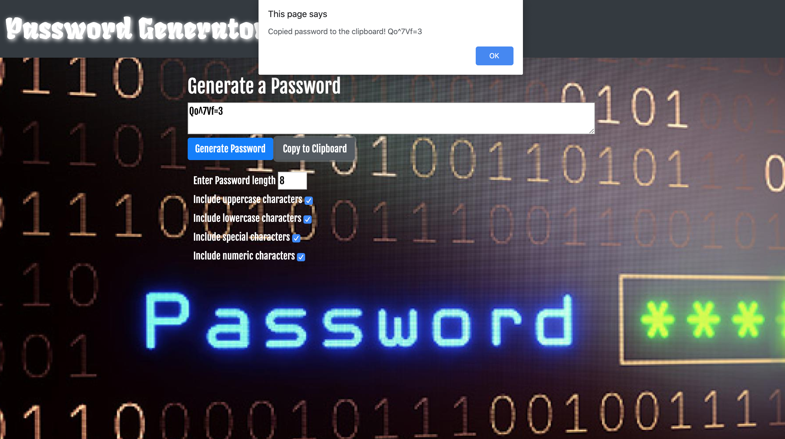

# Password Generator

## Project Title: Password-Generator
## Project Description
This project describes how to create an application that generates a random password based on user-selected criteria. This app will run in the browser and feature dynamically updated HTML and CSS powered by the JavaScript code.
## Installation
In order to install this project, follow the instructions below.
* Prerequisites
Laptop (Mac or Windows) with 8 GB RAM and 64-bit dual-core processor
* Install the following programs on your computer
Visual Studio Code
"Open in Browser" Visual Studio Code extension
Git Bash (Windows only)
Terminal (Mac only; preinstalled)
SSH keys
## Accessing the project files on VS Code
* Create a Github account so you can access the project repository, fork it to your account and then clone (make a copy of the repo) onto your local computer
* Using terminal cd into the directory where the repo is cloned and type command "code ." to open the project in VS code to view the project files
* There are three main files index.html, contact.html and portfolio.html and assets folder which contains css folder with style.css and reset.css files and an images folder with all the images used in the project
* The homepage of this project is called index.html which has the code for the landing page for the basic portfolio website, which contains the information about the developer.

## Screenshots of code and the portfolio webpages
Here is a screenshot of the code snippet from the javascript file

* Password Generator application-
Here is the screenshot of the Password Generator application

* Here is the screenshot of the Password Generator application after the password of 8 character length is generated

